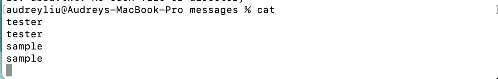

# Lab 1 Report
***
# *`cd command`
1. ## For `cd with *no* arguments`

2. ## For `cd with a path to a *directory* as an argument`

3. ## For `cd with a path to a *file* as an argument`

#*`ls command`
1. ## For `ls with *no* arguments`

2. ## For `ls with a path to a *directory* as an argument`

3. ## For `ls with a path to a *file* as an argument`

#*`cat command`
1. ## For `cat with *no* arguments`

2. ## For `cat with a path to a *directory* as an argument`

3. ## For `cat with a path to a *file* as an argument`

