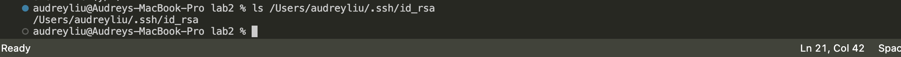
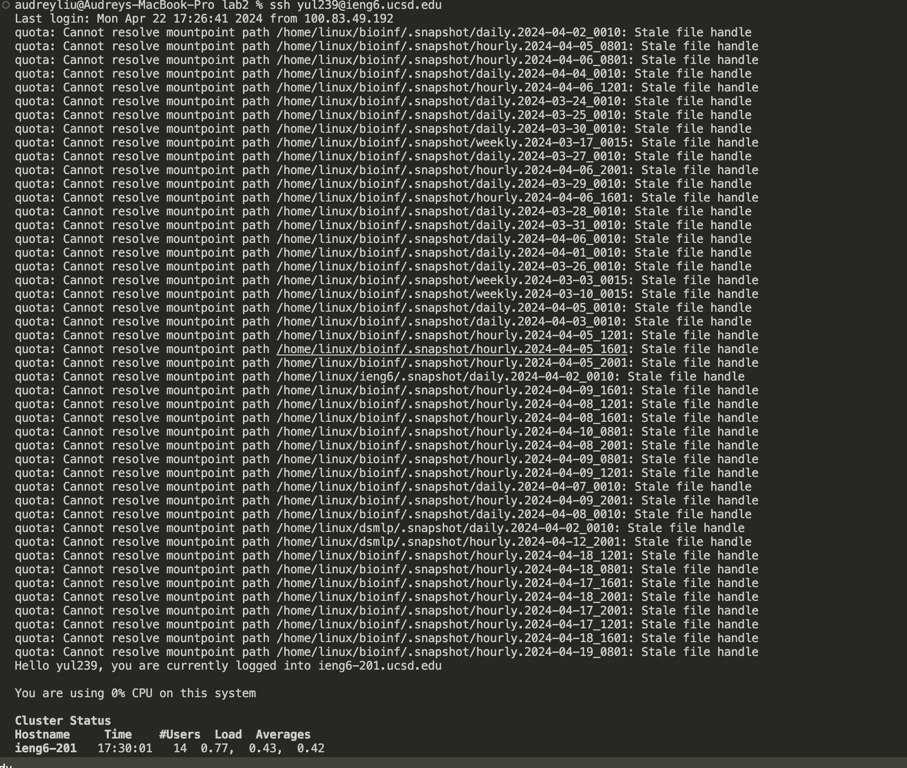
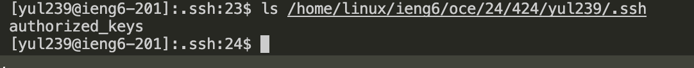

# Part 1
-------------------------------------
>
    import java.io.IOException;
    import java.net.URI;
    
    class Handler implements URLHandler {
        // The one bit of state on the server: a number that will be manipulated by
        // various requests.
        String output = "";
    
        public String handleRequest(URI url) {
            if (url.getPath().equals("/")) {
                return output;
            }
            else if (url.getPath().equals("/add-message")) {
                String query = url.getQuery();
                String user = "";
                String message = "";
                String[] inputs = query.split("&");
    
                for(String input : inputs){
                    String[] paras = input.split("=");
                    if(paras[0].equals("s")){
                        message = paras[1];
                    }
                    else if(paras[0].equals("user")){
                        user = paras[1];
                    }
                }
                if(!user.isEmpty() && !message.isEmpty()){
                    output += user + ": " + message + "\n";
                }
                return output;
            } 
            else {
                return "404 Not Found!";
            }
            // return output;
        }
    }
    
    class ChatServer {
        public static void main(String[] args) throws IOException {
            if(args.length == 0){
                System.out.println("Missing port number! Try any number between 1024 to 49151");
                return;
            }
    
            int port = Integer.parseInt(args[0]);
    
            Server.start(port, new Handler());
        }
    }

1. **Which methods in your code are called?**
> The method that called is `handleRequest`.

2. **What are the relevant arguments to those methods, and the values of any relevant fields of the class?**
> `url`: `http://localhost:2005/add-message?s=Hello&user=jpolitz`

> `user`: `jpolitz`

> `message`: `Hello`
(Those arguments are given by the url.)

> `output`: `""`
(At the beginning, there's nothing stored in `output` field yet.)

3. **How do the values of any relevant fields of the class change from this specific request? If no values got changed, explain why.**
> After run the "handleRequest", the relevant field "message" changes to "Hello: jpolitz".

1. **Which methods in your code are called?**
> The method that called is `handleRequest`.

2. **What are the relevant arguments to those methods, and the values of any relevant fields of the class?**
> `url`: `http://localhost:2005/add-message?s=How%20are%20you&user=yash`

> `user`: `yash`

> `message`: `How are you`
(Those arguments are given by the url.)

> `output`: `Hello: jpolitz`
(At the beginning, that's what stored in `output` field before run the "handleRequest" again.)

3. **How do the values of any relevant fields of the class change from this specific request? If no values got changed, explain why.**
> After run the "handleRequest", the relevant field "message" changes to

`jpolitz: Hello`

`yash: How are you"`

# Part 2
> On the command line of computer, run `ls` with the absolute path

> On the command line of the ieng6 machine, run `ls` with the absolute path to the public key  

> log into `ieng6 account` without being asked for a password

# Part 3
> By learning from week 2 and 3, I learnt that we can run terminal remotely, `ssh` is connected between my persoanl terminal to the school remote cloud. Also, after setting the remote terminal, it allows me to log into it without entering password after first time setup which makes the entire connecting process more easier. Also, from week 2, I learned how to generate a personal url by simply programming it.
